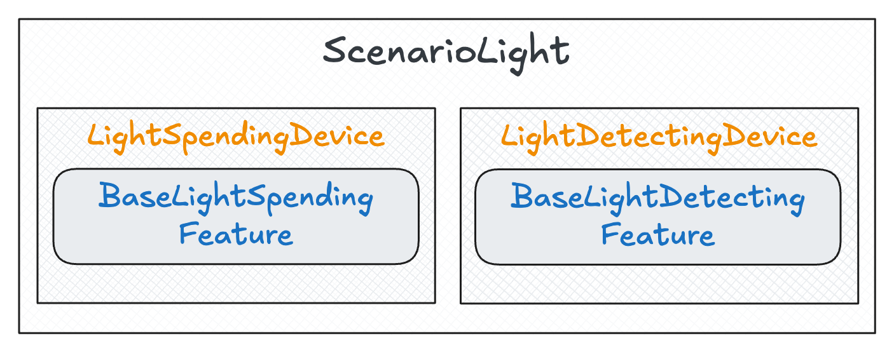
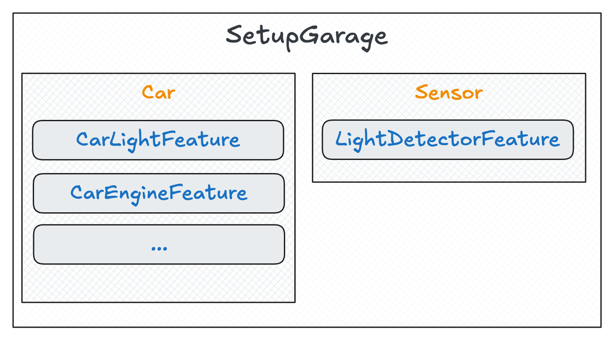

<div align="center">
  
</div>

Balder is a Python test system that allows you to reuse test code written once for different product versions or 
variations, without any code duplicates. By separating the test logic from the product-specific implementation, it 
allows you to **adapt entire test suites to new devices or technologies in minutes** - even if they use completely 
different underlying mechanisms.

This enables you to **install ready-to-use test cases** and provides various test development features that 
helps to test software or embedded devices much faster.

You can import reusable test code (fully customizable) from [existing BalderHub project](https://hub.balder.dev), or 
build your own one.

Be part of the progress and share your tests within your team, your company, or the whole world.


# Installation

You can install the latest release with pip:

```
python -m pip install baldertest
```

# Run Balder

After you've installed it, you can run Balder with the following command:

```
balder
```

You can also provide a specific path to the balder environment directory by using this console argument:

```
balder --working-dir /path/to/working/dir
```

# How does it work?

Balder allows to reuse test code by splitting tests into two key concepts:

**Scenarios:** Define what **is needed** for a test - mostly abstract business logic without implementation details.

**Setups:** Describe what **you have** available - concrete implementations of the (abstract) features from Scenarios.

Tests are written as methods in Scenario classes (prefixed with `test_*`). Balder automatically resolves compatible 
mappings between Scenarios and Setups, generating and running variations dynamically.

## Define the `Scenario` class

Scenarios use inner Device classes to outline required devices and their features. Features are abstract classes 
defining interfaces (e.g., methods like `switch_on()`).

Let's create a new scenario with two devices. One device emitting light and another device that detects light:



Here's an implementation of this Scenario:

```python
import balder
from lib.scenario_features import BaseLightSpendingFeature, BaseLightDetectorFeature


class ScenarioLight(balder.Scenario):
    
    # The devices with its features that are required for this test
    
    class LightSpendingDevice(balder.Device):
        light = BaseLightSpendingFeature()
    
    @balder.connect(LightSpendingDevice, over_connection=balder.Connection)
    class LightDetectingDevice(balder.Device):
        detector = BaseLightDetectorFeature()
    
    # TEST METHOD: needs to start with `test_*` and is defined in scenarios only 
    #  -> can use all scenario device features
    def test_check_light(self):
        self.LightSpendingDevice.light.switch_on()
        assert self.LightDetectingDevice.detector.light_is_on()
        self.LightSpendingDevice.light.switch_off()
        assert not self.LightDetectingDevice.detector.light_is_on()
        
    

```

This Scenario requires two devices: one to emit light and one to detect it. The test logic remains generic.

`BaseLightSpendingFeature`: Abstract feature with methods like `switch_on()` and `switch_off()`.

`BaseLightDetectorFeature`: Abstract feature with methods like `light_is_on()`.

Both devices are connected to each other (defined with the `@balder.connect(..)`), because the light-emitting device
and the light detecting device need to interact somehow.

## Define the `Setup` class

Next step is defining a `Setup` class that describes what **we have**. For a `Scenario` to match a 
`Setup`, every feature required by the Scenario must exist as a subclass within the corresponding mapped Device in the 
Setup.

For testing a car with a light in a garage setup `SetupGarage`:



In code, this looks like:

```python
import balder
from lib.setup_features import CarEngineFeature, CarLightFeature, \
    LightDetectorFeature


class SetupGarage(balder.Setup):
    
    class Car(balder.Device):
        car_engine = CarEngineFeature()
        car_light = CarLightFeature() # subclass of `BaseLightSpendingFeature`
        ...
    
    @balder.connect(Car, over_connection=balder.Connection)
    class Sensor(balder.Device):
        detector = LightDetectorFeature()  # subclass of `BaseLightDetectorFeature`

```

Note that `CarLightFeature` is a subclass of `BaseLightSpendingFeature` and `LightDetectorFeature` is a subclass of 
`BaseLightDetectorFeature`.

Balder scans for possible matches by checking whether a setup device provides implementations for all the features 
required by a candidate scenario device. When Balder identifies a valid variation - meaning every scenario device is 
mapped to a setup device that implements all the necessary scenario features - it executes the tests using that 
variation.


In our case, it finds 
one matching variation (`LightSpendingDevice -> Car | LightDetectingDevice -> Sensor`) and runs the test with it.

```shell
+----------------------------------------------------------------------------------------------------------------------+
| BALDER Testsystem                                                                                                    |
|  python version 3.10.12 (main, Aug 15 2025, 14:32:43) [GCC 11.4.0] | balder version 0.1.0b14                         |
+----------------------------------------------------------------------------------------------------------------------+
Collect 1 Setups and 1 Scenarios
  resolve them to 1 valid variations

================================================== START TESTSESSION ===================================================
SETUP SetupGarage
  SCENARIO ScenarioLight
    VARIATION ScenarioLight.LightSpendingDevice:SetupGarage.Car | ScenarioLight.LightDetectingDevice:SetupGarage.Sensor
      TEST ScenarioLight.test_check_light [.]
================================================== FINISH TESTSESSION ==================================================
TOTAL NOT_RUN: 0 | TOTAL FAILURE: 0 | TOTAL ERROR: 0 | TOTAL SUCCESS: 1 | TOTAL SKIP: 0 | TOTAL COVERED_BY: 0
```

## Add another Device to the `Setup` class

Now the big advantage of Balder comes into play. We can run our test with all devices that can implement the 
`BaseLightSpendingFeature`, independent of how this will be implemented in detail. 
**You do not need to rewrite the test**.

So, we have more devices in our garage. So let's add them:


```python
import balder
from lib.setup_features import CarEngineFeature, CarLightFeature, \
    PedalFeature, BicycleLightFeature, \
    GateOpenerFeature, \
    LightDetectorFeature


class SetupGarage(balder.Setup):
    
    class Car(balder.Device):
        car_engine = CarEngineFeature()
        car_light = CarLightFeature() # subclass of `BaseLightSpendingFeature`
        ...
    
    class Bicycle(balder.Device):
        pedals = PedalFeature()
        light = BicycleLightFeature() # another subclass of `BaseLightSpendingFeature`
        
    class GarageGate(balder.Device):
        opener = GateOpenerFeature()

    @balder.connect(Car, over_connection=balder.Connection)
    @balder.connect(Bicycle, over_connection=balder.Connection)
    class Sensor(balder.Device):
        detector = LightDetectorFeature()  # subclass of `BaseLightDetectorFeature`


```


The `BicycleLightFeature` can be implemented totally different to the `CarLightFeature`, but because it always provides
an implementation for the abstract methods within `BaseLightSpendingFeature`, the test can be executed 
in both variants.

Balder now detects the two variations (`Car` and `Bicycle` as light sources):


Running Balder looks like shown below:

```shell
+----------------------------------------------------------------------------------------------------------------------+
| BALDER Testsystem                                                                                                    |
|  python version 3.10.12 (main, Aug 15 2025, 14:32:43) [GCC 11.4.0] | balder version 0.1.0b14                         |
+----------------------------------------------------------------------------------------------------------------------+
Collect 1 Setups and 1 Scenarios
  resolve them to 2 valid variations

================================================== START TESTSESSION ===================================================
SETUP SetupGarage
  SCENARIO ScenarioLight
    VARIATION ScenarioLight.LightSpendingDevice:SetupGarage.Bicycle | ScenarioLight.LightDetectingDevice:SetupGarage.Sensor
      TEST ScenarioLight.test_check_light [.]
    VARIATION ScenarioLight.LightSpendingDevice:SetupGarage.Car | ScenarioLight.LightDetectingDevice:SetupGarage.Sensor
      TEST ScenarioLight.test_check_light [.]
================================================== FINISH TESTSESSION ==================================================
TOTAL NOT_RUN: 0 | TOTAL FAILURE: 0 | TOTAL ERROR: 0 | TOTAL SUCCESS: 2 | TOTAL SKIP: 0 | TOTAL COVERED_BY: 0
```

The test implementation within the `ScenarioLight` has not changed, but the execution will be once with the 
`CarLightFeature` and once with the `BicycleLightFeature`!

## Use another Light-Sensor

Do you have another test setup, that is using another method to check if the light is powered on? Replace 
`LightDetectorFeature` with the new `MeasureLightByVoltageFeature` (is a subclass of `BaseLightDetectorFeature` 
too):


```python
import balder
from lib.setup_features import CarEngineFeature, CarLightFeature, \
    PedalFeature, BicycleLightFeature, \
    GateOpenerFeature, \
    MeasureLightByVoltageFeature


class SetupLaboratory(balder.Setup):
    
    class Car(balder.Device):
        car_engine = CarEngineFeature()
        car_light = CarLightFeature() # subclass of `BaseLightSpendingFeature`
        ...
    
    class Bicycle(balder.Device):
        pedals = PedalFeature()
        light = BicycleLightFeature() # another subclass of `BaseLightSpendingFeature`
        
    class GarageGate(balder.Device):
        opener = GateOpenerFeature()

    @balder.connect(Car, over_connection=balder.Connection)
    @balder.connect(Bicycle, over_connection=balder.Connection)
    class Sensor(balder.Device):
        detector = MeasureLightByVoltageFeature()  # another subclass of `BaseLightDetectorFeature`


```

And when Balder is executed, it performs both settings, once by measuring the light with the sensor (`SetupGarage`) and 
once by detecting it via the voltage measurement (`SetupLaboratory`).

```shell
+----------------------------------------------------------------------------------------------------------------------+
| BALDER Testsystem                                                                                                    |
|  python version 3.10.12 (main, Aug 15 2025, 14:32:43) [GCC 11.4.0] | balder version 0.1.0b14                         |
+----------------------------------------------------------------------------------------------------------------------+
Collect 2 Setups and 1 Scenarios
  resolve them to 4 valid variations

================================================== START TESTSESSION ===================================================
SETUP SetupGarage
  SCENARIO ScenarioLight
    VARIATION ScenarioLight.LightSpendingDevice:SetupGarage.Bicycle | ScenarioLight.LightDetectingDevice:SetupGarage.Sensor
      TEST ScenarioLight.test_check_light [.]
    VARIATION ScenarioLight.LightSpendingDevice:SetupGarage.Car | ScenarioLight.LightDetectingDevice:SetupGarage.Sensor
      TEST ScenarioLight.test_check_light [.]
SETUP SetupLaboratory
  SCENARIO ScenarioLight
    VARIATION ScenarioLight.LightSpendingDevice:SetupLaboratory.Bicycle | ScenarioLight.LightDetectingDevice:SetupLaboratory.Sensor
      TEST ScenarioLight.test_check_light [.]
    VARIATION ScenarioLight.LightSpendingDevice:SetupLaboratory.Car | ScenarioLight.LightDetectingDevice:SetupLaboratory.Sensor
      TEST ScenarioLight.test_check_light [.]
================================================== FINISH TESTSESSION ==================================================
TOTAL NOT_RUN: 0 | TOTAL FAILURE: 0 | TOTAL ERROR: 0 | TOTAL SUCCESS: 4 | TOTAL SKIP: 0 | TOTAL COVERED_BY: 0
```

Balder takes care of all that for you. All you need to do is describe your environments by defining the `Scenario` and 
`Setup` classes and provide the specific implementations by creating the setup level features. Balder automatically 
determines the applicable variations and runs the tests with them.

**NOTE:** Balder offers many more elements to design complete device structures, including connections between 
devices.

You can learn more about that in the 
[Tutorial Section of the Documentation](https://docs.balder.dev/en/latest/tutorial_guide/index.html).


# Example: Use an installable BalderHub package

With Balder, you can create custom test environments or install open-source-available test packages, known as 
[BalderHub packages](https://hub.balder.dev). For example, if you want to test the login functionality of a website, simply use the 
ready-to-use scenario `ScenarioSimpleLogin` from the [`balderhub-auth` package](https://hub.balder.dev/projects/auth/en/latest/examples.html), 


If you want to use [Selenium](https://www.selenium.dev/) to control the browser and of course use html elements, you can install 
`balderhub-selenium` and `balderhub-html` right away.

```
$ pip install balderhub-auth balderhub-selenium balderhub-html
```

Instead of writing an own test scenario, you can simply import a ready-to-use one:

```python
# file `scenario_balderhub.py`

from balderhub.auth.scenarios import ScenarioSimpleLogin

```

According to the [documentation of this BalderHub project](https://hub.balder.dev/projects/auth/en/latest/examples.html), 
we only need to define the login page by overwriting the ``LoginPage`` feature:

```python

# file `lib/pages.py`

import balderhub.auth.contrib.html.pages
from balderhub.html.lib.utils import Selector
from balderhub.url.lib.utils import Url
import balderhub.html.lib.utils.components as html


class LoginPage(balderhub.auth.contrib.html.pages.LoginPage):

    url = Url('https://example.com')

    # Overwrite abstract property
    @property
    def input_username(self):
        return html.inputs.HtmlTextInput.by_selector(self.driver, Selector.by_name('user'))

    # Overwrite abstract property
    @property
    def input_password(self):
        return html.inputs.HtmlPasswordInput.by_selector(self.driver, Selector.by_name('user'))

    # Overwrite abstract property
    @property
    def btn_login(self):
        return html.HtmlButtonElement.by_selector(self.driver, Selector.by_id('submit-button'))

```

And use it in our setup:

```python


# file `setups/setup_office.py`

import balder
import balderhub.auth.lib.scenario_features.role
from balderhub.selenium.lib.setup_features import SeleniumChromeWebdriverFeature

from lib.pages import LoginPage
from lib.setup_features import UserConfig  # another feature providing the user login data 

class SetupOffice(balder.Setup):

    class Server(balder.Device):
        user = UserConfig()

    class Browser(balder.Device):
        selenium = SeleniumChromeWebdriverFeature()
        page_login = LoginPage()

    # fixture to prepare selenium - will be executed before the test session runs
    @balder.fixture('session')
    def selenium(self):
        self.Browser.selenium.create()
        yield
        self.Browser.selenium.quit()
```

When you run Balder now, it will execute a complete login test that you didn't write yourself - 
**it was created by the open-source community**.

```shell
+----------------------------------------------------------------------------------------------------------------------+
| BALDER Testsystem                                                                                                    |
|  python version 3.10.12 (main, Aug 15 2025, 14:32:43) [GCC 11.4.0] | balder version 0.1.0b14                         |
+----------------------------------------------------------------------------------------------------------------------+
Collect 1 Setups and 1 Scenarios
  resolve them to 1 valid variations

================================================== START TESTSESSION ===================================================
SETUP SetupOffice
  SCENARIO ScenarioSimpleLogin
    VARIATION ScenarioSimpleLogin.Client:SetupOffice.Browser | ScenarioSimpleLogin.System:SetupOffice.Server
      TEST ScenarioSimpleLogin.test_login [.]
================================================== FINISH TESTSESSION ==================================================
TOTAL NOT_RUN: 0 | TOTAL FAILURE: 0 | TOTAL ERROR: 0 | TOTAL SUCCESS: 1 | TOTAL SKIP: 0 | TOTAL COVERED_BY: 0
```

If you'd like to learn more about it, feel free to dive [into the documentation](https://balder.dev).

# Contribution guidelines

Any help is appreciated. If you want to contribute to balder, take a look into the 
[contribution guidelines](https://github.com/balder-dev/balder/blob/main/CONTRIBUTING.md).

Are you an expert in your field? Do you enjoy the concept of balder? How about creating your own
BalderHub project? You can contribute to an existing project or create your own. If you are not sure, a project for 
your idea already exists or if you want to discuss your ideas with others, feel free to
[create an issue in the BalderHub main entry project](https://github.com/balder-dev/hub.balder.dev/issues) or
[start a new discussion](https://github.com/balder-dev/hub.balder.dev/discussions).

# License

Balder is free and Open-Source

Copyright (c) 2022-2026 Max Stahlschmidt and others

Distributed under the terms of the MIT license
