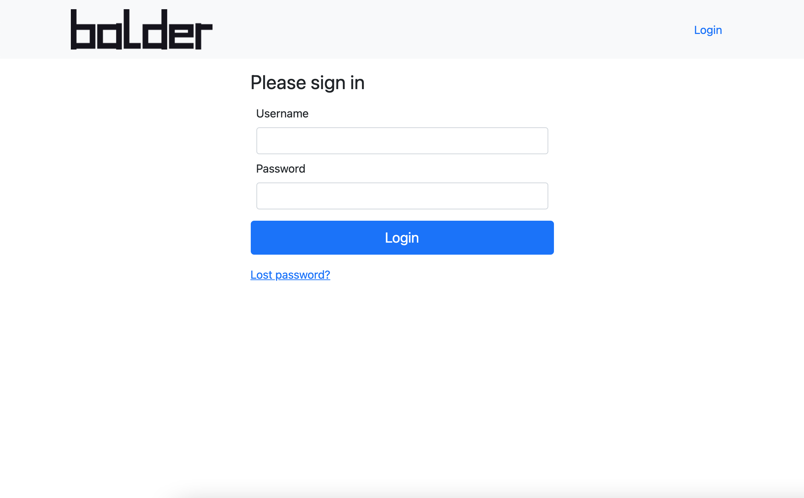

Part 2: Implement browser setup
*******************************

Before we start to implement our first setup, let's take a look to the login-page. If you
:ref:`start the development server <Start development server>` and open the login page with a browser of your choice
you will see the login page.

We want to create a setup that allows to test this login screen now.

Install mechanize
=================

We need a package that allows us to control a Browser window. For this we use the
`python package mechanize <https://mechanize.readthedocs.io/en/latest/>`_, which is a stateful programmatic web browsing
python package, that allows to fill simple forms and clicking links of a html page.

We can simply install the python package with the command:

.. code-block::

    >>> pip install mechanize

Create the new setup
====================

We want to create a setup for our scenario that allows us to login over the mentioned web interface. First we have to
create a new module `setups`. This can be done, by creating a new directory ``setups`` and add a ``__init__``
file into it. In this directory we also add our new setup file ``setup_web_browser.py``. This results in the following
new directory structure:

.. code-block:: none

    - balderexample-loginserver/
        |- ...
        |- tests
            |- lib
                |- __init__.py
                |- features.py
                |- connections.py
            |- scenarios
                |- __init__.py
                |- scenario_simple_loginout.py
            |- setups
                |- __init__.py
                |- setup_web_browser.py

We can now create the initial setup class in our newly created file:

.. code-block:: python

    # file tests/setups/setup_web_browser.py
    import balder

    class SetupWebBrowser(balder.Setup):

        pass

We want to create a setup, that matches with our scenario, we have created in
:ref:`part 1 <Part 1: Develop a scenario>`. In our scenario we defined two devices we need for the execution. These two
devices are needed in our setup too.

Think about devices
-------------------

For a setup to match a scenario, there has to be a variation between its devices that matches. A setup device matches
with a scenario device if it implements at least all features (by inheriting from them) and fulfill the connections.

.. note::
    This also means that a setup can have devices or features that are not mentioned in the scenario.

So, according to our developed scenario we have developed in :ref:`part 1 <Part 1: Develop a scenario>`, we need two
devices that implements the following features:

``MechanizeClient``:

* ``InsertCredentialsFeature``
* ``ViewInternalPageFeature``

``Loginserver``:

* ``HasLoginSystemFeature`` (autonomous feature)
* ``ValidRegisteredUserFeature``

These features have to be available in our setup so that Balder allows our newly created ``SetupWebBrowser`` as matching
candidate for our scenario. Except for the ``HasLoginSystemFeature`` all other features are abstract features, that has
no implementation yet.

**Balder-Matching-Mechanism:**

In the solving process, Balder determines all combinations a setup and scenario could be mapped. It also creates sub
combinations about how their devices could be combined with each other. During this initial mapping, compatibility
between the setup and scenario is not necessarily checked.

However, before the variation is executed, Balder takes the extra step of verifying that the current variation is valid.
This means that the setup candidate must have a device that implements all the features (inherits from them) of the
current mapped scenario device in order for the variation to be accepted. In addition to that, also the defined
scenario-device-connections have to BE IN the related connections of the setup devices.

If you want to learn more about, how Balder works, check out the :ref:`Balder Execution mechanism`.

Autonomous feature
------------------

The autonomous feature ``HasLoginSystemFeature`` is a feature that doesn't contain some functional code, it simply
stands for a functionality the device has, but we do not interact with it. For example that the device has the
color red or in our case, that the device **has a login feature**. For this we have not to provide a special
implementation, we can simply add it to every device that has this feature.

You can find more about autonomous features :ref:`here <Autonomous-Features>`.

Abstract features
-----------------

Most of the features we have implemented so far are abstract and have no implementation or at least have no complete
implementation. This is often the case for scenario features, because it simply can't be provided. In many cases, it is
impossible to provide the full implementation on scenario-level because the situation does not permit such knowledge.
Take for example a reset function; without understanding what needs to be reset there, it is hard to really implement
the full feature. We use the scenario-level feature to provide the interface or in pythonic words, the abstract methods,
which define **what we need**.

Therefore, in Balder, the implementation is often done at the setup-level.

For this we add a new file `features` in the `setups` directory:

.. code-block:: none

    - balderexample-loginserver/
        |- ...
        |- tests
            ...
            |- setups
                |- __init__.py
                |- features.py
                |- setup_web_browser.py

This newly created file ``features.py`` should contain our specific feature implementations for the browser controllable
login.

.. note::
    In :ref:`Part 3: Expand setup code` we will expand this and use real hierarchy structured setup-feature code,
    but for now this is quite sufficient.

.. note::
    Please note, that the structure described here is not the be-all and end-all, but it makes often sense to capsule
    the features in specific namespace areas, like shown in this tutorial.

Add the devices
---------------

In the same way we have developed our scenario in :ref:`part 1 <Part 1: Develop a scenario>`, we add the features
before we really implement it. For an easier understanding, we use a simple name format for the features we will
overwrite in our setup area. Every of these features will be named like ``My<scenario-feature-name>``.

.. note::
    If you're developing a real test project, it's a good idea to think about encapsulating your features in their own
    namespaces. For example, you could create a file for all setup features and import them using
    ``from project.setups import setup_features``. This approach will make it much easier to keep track of all the
    features in your project, as well as making it more organized and easier to maintain. It will also make it easier
    to add new features in the future.

We will already add the import statement even if we don't have an implementation yet. Often this helps to get a clearer
imagine about the things we need. We will import these features from the setup feature file ``setups/features.py``, that
we have created recently.

``Loginserver``:

* ``HasLoginSystemFeature`` (autonomous feature, can be imported directly from SCENARIO-LEVEL lib folder)
* ``MyValidRegisteredUserFeature`` (specific setup feature)

``MechanizeClient``:

* ``MyInsertCredentialsFeature`` (specific setup feature)
* ``MyViewInternalPageFeature`` (specific setup feature)

We want to connect the two devices exactly in the same way as in the scenario. So we only use a simply
``HttpConnection``:

.. code-block:: python

    import balder
    # we can directly import the autonomous feature
    from ..lib.features import HasLoginSystemFeature
    # all new features has to be imported from the global setup feature file, where we will define them later
    from .features import MyValidRegisteredUserFeature, MyInsertCredentialsFeature, MyViewInternalPageFeature

    class SetupWebBrowser(balder.Setup):

        class Server(balder.Device):
            _ = HasLoginSystemFeature()
            valid_user = MyValidRegisteredUserFeature()

        @balder.connect(ServerDevice, conn.HttpConnection)
        class Client(balder.Device):
            credentials = MyInsertCredentialsFeature()
            internal = MyViewInternalPageFeature()

As you can see, the devices directly inherit from the basic Balder device and not from the scenario device.
Balder manage this automatically. Balder doesn't really care for the device class, because it only exchange the
features of it, but does not change the device itself.

What's about the vDevices?
--------------------------

As you have seen in our :ref:`scenario definition <Think about device features>`, we uses vDevices on scenario-level. To
understand why we use them, let's check the earlier used scenario code again. Our scenario device definition looks like
the following:

.. code-block:: python

    import balder
    import balder.connections as conn

    class ScenarioSimpleLoginOut(balder.Scenario):

        class ServerDevice(balder.Device):
            ...

        @balder.connect(ServerDevice, conn.HttpConnection)
        class ClientDevice(balder.Device):
            login_out = InsertCredentialsFeature(Server="ServerDevice")
            ...

In the ``InsertCredentialsFeature`` constructor, that is used by the ``ClientDevice`` we have defined a mapping between
our vDevice ``Server`` and our real device ``ServerDevice``. With this, we tell Balder that we want to use the
``Server`` vDevice and that our real device ``ServerDevice`` should be mapped to it, thus representing it.

By instantiating own features inside the vDevice, we define, that Balder should ensure that our mapped device (in our
case ``ServerDevice``) also provides an implementation for them.

You can see this definition also inside the feature ``InsertCredentialsFeature``:

.. code-block:: python

    # file tests/lib/features.py

    ...

    class InsertCredentialsFeature(balder.Feature):

        class Server(balder.VDevice):
            _ = HasLoginSystemFeature()

        ...

    ...

You can see that our mapped vDevice ``Server``, needs a connection to a device that at least implements the
``HasLoginSystemFeature``. However, since this is only an autonomous feature, we just define that our peer device has to
provide this autonomous feature too. It simply doesn't make sense to use this feature without
another device that provides this interface.

.. note::
    Of course you can also add normal features to your vDevices. By adding real normal features, you can access the
    features of the mapped peer device over these vDevices. This makes it possible that you can request configurations
    from a peer device inside a feature.

This vDevice-Device mapping also affects our setup, but we don't have to define the mapping again in the setup. It will
automatically secured by the device mapping algorithm.

.. note::
    It is also possible to assign a vDevice in the setup.

This vDevice mechanism is very powerful. You are also able to define different methods for different mapped vDevices. If
you want to find out more about that, check the section :ref:`VDevices and method-variations`.

Implement the setup-features
============================

Now let us implement the different features we have already imported. Open the file ``setups/features.py`` and add the
basic code. Secure that you inherit from the parent classes of the scenario level. With inheritance Balder secures that
a feature belongs to another. We also add the abstract methods, we have defined earlier that are filled with an
``NotImplementedError``. We will provide the full implementation of our methods there later:

.. code-block:: python

    import balder
    from ..lib.features import InsertCredentialsFeature, ViewInternalPageFeature, BrowserSessionManagerFeature, \
        ValidRegisteredUserFeature

    # Server features
    class MyValidRegisteredUserFeature(ValidRegisteredUserFeature):
        def get_valid_user(self):
            pass

    # Client features

    class MyInsertCredentialsFeature(InsertCredentialsFeature):

        class Server(InsertCredentialsFeature.Server):
            pass

        def insert_username(self, username):
            pass

        def insert_password(self, password):
            pass

        def execute_login(self):
            pass

        def execute_logout(self):
            pass

    class MyViewInternalPageFeature(ViewInternalPageFeature):

        class Server(ViewInternalPageFeature.Server):
            pass

        def check_internal_page_viewable(self):
            pass

As you can see, we have overwritten the internal empty vDevices here too, because we will add some more features there
later. You can add features to a vDevice by overwriting the inner class with the same name of the vDevice class and
inheriting from the next parent. This is done here for the features ``MyInsertCredentialsFeature`` and
``MyViewInternalPageFeature``.

Client feature
--------------

We want to start with the method ``MyValidRegisteredUserFeature.get_user()``. This method should return a tuple with the
username and the password. According to the
`README.md file of the balderexample-loginserver repository <https://github.com/balder-dev/balderexample-loginserver/blob/main/README.md#users>`_,
the server provides static credentials:

Username: ``guest``
Password: ``guest12345``

We simply add a return statement with these values:

.. code-block:: python

    ...

    class MyValidRegisteredUserFeature(ValidRegisteredUserFeature):

        def get_user() -> Tuple[str, str]:
            return "guest", "guest12345"

    ...

That was easy, wasn't it? So lets get a little bit deeper.

Reference a feature from another
--------------------------------

The ``mechanize`` package allows accessing the browser content with a so called ``mechanize.Browser`` object. After
instantiating, you can browse through a website while it handles all session stuff for us. For using it, we should
instantiate it only once.

In our client device, we have two features to implement, the ``MyInsertCredentialsFeature`` and the
``MyViewInternalPageFeature``. Both of them must have access to the same browser.

With that, we need the same ``Browser`` object for the whole test session, but for us it seems hard to share this object
between different feature instances. We can not add it to the constructor or something similar. But how can we share
this?

We can use a shared feature, that is referred in our both feature classes
``MyInsertCredentialsFeature`` and ``MyViewInternalPageFeature``.

.. note::

    We will add this shared feature only in setup code. The scenario implementation hasn't changed, it does not know
    anything about a browser object. This allows us to create other setups that do not implement our specific mechanize
    feature.

    With that we are really flexible, because we can provide different implementations for the same scenario-features on
    setup-level.

Let's call this feature ``BrowserSessionManagerFeature``. It should completely manage this browser object and also
provide some methods, we can interact with.

We add this feature to our file ``setups/features.py`` too. Because this feature is new, we can directly inherit from
``balder.Feature`` and don't need some inheritance from the SCENARIO LEVEL:

.. code-block:: python

    class BrowserSessionManagerFeature(balder.Feature):
        # our mechanize browser object that simulates the browser
        browser = None

First of all we add a property ``browser``, which should be managed by some methods. Two methods are enough for our
application. We will add a method ``create_browser_if_necessary()`` which should create a browser only if there was no
browser object generated before and a method ``open_page()`` that opens a url. For the implementation we have to add
some simple mechanize code.

.. code-block:: python

    class BrowserSessionManagerFeature(balder.Feature):
        # our mechanize browser object that simulates the browser
        browser = None

        def create_browser_if_necessary(self):
            if self.browser is None:
                self.browser = mechanize.Browser()

        def open_page(self, open_page_url=None):
            return self.browser.open(open_page_url)

That's all. But how can we use this feature in our features ``MyInsertCredentialsFeature`` and
``MyViewInternalPageFeature``, that both needing access to it. That is really easy, simply instantiate it as static
class property in the features that want to use it. For example, this can look like the following code:

.. code-block:: python

    class MyViewInternalPageFeature(ViewInternalPageFeature):

        ...

        browser_manager = BrowserSessionManagerFeature()

        ...

This allows you to simply refer it from your methods. It also defines that every device that uses the feature
`MyViewInternalPageFeature` (by defining it as static attribute), has also implement the `BrowserSessionManagerFeature`.

Implement the client setup-features
-----------------------------------

As you may remember the setup features ``MyInsertCredentialsFeature`` and ``MyViewInternalPageFeature`` (which we still
have to implement) have a vDevice ``Server`` in our scenario implementation. But on this scenario level implementation,
the vDevice has only the one autonomous feature ``HasLoginSystemFeature``.

We have written a very universal scenario-level feature, which is often a good decision. This allows a very flexible
scenario implementation. But now on setup-level, we need some more information from our communication partner device
that is mapped to the vDevice ``MyInsertCredentialsFeature.Server``.

Balder allows us to access these information by simply specifying the features that provide this info in our vDevice.
As mentioned earlier, we can overwrite a vDevice, by inheriting from the vDevice of the parent feature class **and**
give the same class name to the child vDevice class:

.. code-block:: python

    class MyViewInternalPageFeature(ViewInternalPageFeature):

        class Server(ViewInternalPageFeature.Server):
            pass

        browser_manager = BrowserSessionManagerFeature()

.. note::
    Note that it is really important, that the child vDevice class has the same name that is given in the parent feature
    class! Otherwise the child vDevice will be interpreted as a new vDevice! In this case this will produce an exception
    because Balder only allows the redefining of inner devices by overwriting them all on one class level.

In a few moments, we will create a new feature class ``InternalWebpageFeature`` that should return some constant values
about the server (for example the webpage url). This feature should be implemented by our real server device. We can
ensure this on feature level, by adding this feature to our vDevice ``Server``:

.. code-block:: python

    class MyViewInternalPageFeature(ViewInternalPageFeature):

        class Server(ViewInternalPageFeature.Server):
            internal_webpage = InternalWebpageFeature()

        browser_manager = BrowserSessionManagerFeature()

Just as we have already done with normal devices, we can address our feature in the vDevice, by using its property. So
let us add an implementation for our abstract method ``ViewInternalPageFeature.check_internal_page_viewable()`` by
using our new vDevice-Feature:

.. code-block:: python

    class MyViewInternalPageFeature(ViewInternalPageFeature):

        class Server(ViewInternalPageFeature.Server):
            internal_webpage = InternalWebpageFeature()

        browser_manager = BrowserSessionManagerFeature()

        def check_internal_page_viewable(self):
            self.browser_manager.create_browser_if_necessary()
            self.browser_manager.open_page(self.Server.internal_webpage.url)
            if self.browser_manager.browser.title() != self.Server.internal_webpage.title:
                # redirect to another webpage -> not able to read the internal webpage
                return False
            return True

We will do the same for the other feature and also add another feature ``LoginWebpageFeature`` (which we will also
implement in a few moments) to its vDevice:

.. code-block:: python

    class MyInsertCredentialsFeature(InsertCredentialsFeature):

        class Server(InsertCredentialsFeature.Server):
            login_webpage = LoginWebpageFeature()
            internal_webpage = InternalWebpageFeature()

        browser_manager = BrowserSessionManagerFeature()
        setup_done = False

        def do_setup_if_necessary(self):
            if not self.setup_done:
                self.browser_manager.create_browser_if_necessary()
                self.browser_manager.open_page(self.Server.login_webpage.url)
                self.setup_done = True

        def insert_username(self, username):
            self.do_setup_if_necessary()
            # now insert the username
            self.browser_manager.browser.select_form(name=self.Server.login_webpage.dom_name_login_form)
            self.browser_manager.browser[self.Server.login_webpage.dom_name_username_field] = username

        def insert_password(self, password):
            self.do_setup_if_necessary()
            # now insert the password
            self.browser_manager.browser.select_form(name=self.Server.login_webpage.dom_name_login_form)
            self.browser_manager.browser[self.Server.login_webpage.dom_name_password_field] = password

        def execute_login(self):
            response = self.browser_manager.browser.submit()
            return response.wrapped.code == 200

        def execute_logout(self):
            response = self.browser_manager.open_page(self.Server.internal_webpage.url_logout)
            return response.wrapped.code == 200

We will implement the newly created ``LoginWebpageFeature`` in the ``Server`` vDevice in the next stage.

.. note::
    The overwritten feature also implements a new method ``do_setup_if_necessary()``. This is no problem, even if it is
    not defined in the parent feature. In the normal way like inheriting works, you can freely implement more logic in
    child classes.

Implement the vDevice features
------------------------------

We have created some new features that we need specially for this setup, the ``LoginWebpageFeature`` and
``InternalWebpageFeature``. We only use some constants here. Let's define these features.

.. code-block:: python

    class LoginWebpageFeature(balder.Feature):
        @property
        def url(self):
            return "http://localhost:8000/accounts/login"

        @property
        def dom_name_login_form(self):
            return "login"

        @property
        def dom_name_username_field(self):
            return "username"

        @property
        def dom_name_password_field(self):
            return "password"

    class InternalWebpageFeature(balder.Feature):
        @property
        def url(self):
            return "http://localhost:8000"

        @property
        def title(self):
            return "Internal"

        @property
        def url_logout(self):
            return "http://localhost:8000/accounts/logout"

.. note::
    **We instantiate every feature multiple times, why do we think they are synchronized?**

    Before a variation (fixed mapping between scenario and setup devices) will be executed, Balder automatically
    exchanges all objects with the original objects that were instantiated in the setup. Everywhere! In all inner
    feature references (also feature properties that are other instantiated features), scenarios, vDevices and so on.

Update our setup
----------------

Our setup can not be resolved yet, because our server device does not have the vDevice features we have defined. For
this we have to add them.

Our new setup devices should implement the following:

.. code-block:: python

    import balder
    from tests.lib.features import HasLoginSystemFeature
    from tests.setups import features as setup_features

    class SetupWebBrowser(balder.Setup):

        class Server(balder.Device):
            _ = HasLoginSystemFeature()
            login_webpage = setup_features.LoginWebpageFeature()
            internal_webpage = setup_features.InternalWebpageFeature()
            valid_user = setup_features.MyValidRegisteredUserFeature()

        class Client(balder.Device):
            browser_manager = setup_features.BrowserSessionManagerFeature()
            credentials = setup_features.MyInsertCredentialsFeature()
            internal = setup_features.MyViewInternalPageFeature()

The whole setup and its features
================================

Done, we have successfully implement our setup. The whole code is shown below, but you can find the code
in the `single-setup branch on GitHub <https://github.com/balder-dev/balderexample-loginserver/tree/single-setup>`_ too.

.. code-block:: python

    # file tests/setups/features.py
    import balder
    from ..lib.features import InsertCredentialsFeature, ViewInternalPageFeature, BrowserSessionManagerFeature, \
        ValidRegisteredUserFeature

    # Server features
    class MyValidRegisteredUserFeature(ValidRegisteredUserFeature):
        def get_valid_user(self):
            return "guest", "guest12345"

    class LoginWebpageFeature(balder.Feature):
        @property
        def url(self):
            return "http://localhost:8000/accounts/login"

        @property
        def dom_name_login_form(self):
            return "login"

        @property
        def dom_name_username_field(self):
            return "username"

        @property
        def dom_name_password_field(self):
            return "password"

    class InternalWebpageFeature(balder.Feature):
        @property
        def url(self):
            return "http://localhost:8000"

        @property
        def title(self):
            return "Internal"

        @property
        def url_logout(self):
            return "http://localhost:8000/accounts/logout"

    # Client features

    class MyInsertCredentialsFeature(InsertCredentialsFeature):
        class Server(InsertCredentialsFeature.Server):
            login_webpage = LoginWebpageFeature()
            internal_webpage = InternalWebpageFeature()

        browser_manager = BrowserSessionManagerFeature()
        setup_done = False

        def do_setup_if_necessary(self):
            if not self.setup_done:
                self.browser_manager.create_browser_if_necessary()
                self.browser_manager.open_page(self.Server.login_webpage.url)
                self.setup_done = True

        def insert_username(self, username):
            self.do_setup_if_necessary()
            # now insert the username
            self.browser_manager.browser.select_form(name=self.Server.login_webpage.dom_name_login_form)
            self.browser_manager.browser[self.Server.login_webpage.dom_name_username_field] = username

        def insert_password(self, password):
            self.do_setup_if_necessary()
            # now insert the password
            self.browser_manager.browser.select_form(name=self.Server.login_webpage.dom_name_login_form)
            self.browser_manager.browser[self.Server.login_webpage.dom_name_password_field] = password

        def execute_login(self):
            response = self.browser_manager.browser.submit()
            return response.wrapped.code == 200

        def execute_logout(self):
            response = self.browser_manager.open_page(self.Server.internal_webpage.url_logout)
            return response.wrapped.code == 200

    class MyViewInternalPageFeature(ViewInternalPageFeature):
        class Server(ViewInternalPageFeature.Server):
            internal_webpage = InternalWebpageFeature()

        browser_manager = BrowserSessionManagerFeature()

        def check_internal_page_viewable(self):
            self.browser_manager.create_browser_if_necessary()
            self.browser_manager.open_page(self.Server.internal_webpage.url)
            if self.browser_manager.browser.title() != self.Server.internal_webpage.title:
                # redirect to another webpage -> not able to read the internal webpage
                return False
            return True

.. code-block:: python

    # file tests/setups/setup_web_browser.py
    import balder
    from tests.lib.features import HasLoginSystemFeature
    from tests.setups import features as setup_features

    class SetupWebBrowser(balder.Setup):

        class Server(balder.Device):
            _ = HasLoginSystemFeature()
            login_webpage = setup_features.LoginWebpageFeature()
            internal_webpage = setup_features.InternalWebpageFeature()
            valid_user = setup_features.MyValidRegisteredUserFeature()

        class Client(balder.Device):
            browser_manager = setup_features.BrowserSessionManagerFeature()
            credentials = setup_features.MyInsertCredentialsFeature()
            internal = setup_features.MyViewInternalPageFeature()

Execute Balder
==============

Now is the time to execute Balder and take advantage of the benefits it provides. We have a single setup, as well as a
single scenario, where every setup device is mapped to a scenario device, ensuring that each setup device implements
at least the features of its mapped scenario device. Therefore, it is expected that Balder will find exactly one valid
executable variation.

Let's take a look how Balder will resolve our project without really executing it. For this you can add the argument
``--resolve-only`` to the ``balder`` call:

.. code-block::

    $ balder --working-dir tests --resolve-only

.. code-block:: none

    +----------------------------------------------------------------------------------------------------------------------+
    | BALDER Testsystem                                                                                                    |
    |  python version 3.9.7 (default, Sep  3 2021, 12:37:55) [Clang 12.0.5 (clang-1205.0.22.9)] | balder version 0.0.1     |
    +----------------------------------------------------------------------------------------------------------------------+
    Collect 1 Setups and 1 Scenarios
      resolve them to 1 mapping candidates

    RESOLVING OVERVIEW

    Scenario `ScenarioSimpleLoginOut` <-> Setup `SetupWebBrowser`
       ScenarioSimpleLoginOut.ClientDevice = SetupWebBrowser.Client
       ScenarioSimpleLoginOut.ServerDevice = SetupWebBrowser.Server
       -> Testcase<ScenarioSimpleLoginOut.test_valid_login_logout>

Great, the mapping works. Balder finds the valid variation.

Now it is time to really run the Balder session.

.. note::
    Do not forget to start the django server before:

    .. code-block:: none

        $ python manage.py runserver

After you have secured that the django server will be executed, you can start Balder with the command:

.. code-block::

    $ balder --working-dir tests

.. code-block:: none

    +----------------------------------------------------------------------------------------------------------------------+
    | BALDER Testsystem                                                                                                    |
    |  python version 3.9.5 (default, Nov 23 2021, 15:27:38) [GCC 9.3.0] | balder version 0.0.1                            |
    +----------------------------------------------------------------------------------------------------------------------+
    Collect 1 Setups and 1 Scenarios
      resolve them to 1 mapping candidates

    ================================================== START TESTSESSION ===================================================
    SETUP SetupWebBrowser
      SCENARIO ScenarioSimpleLoginOut
        VARIATION ScenarioSimpleLoginOut.ClientDevice:SetupWebBrowser.Client | ScenarioSimpleLoginOut.ServerDevice:SetupWebBrowser.Server
          TEST ScenarioSimpleLoginOut.test_valid_login_logout [✓]
    ================================================== FINISH TESTSESSION ==================================================
    TOTAL NOT_RUN: 0 | TOTAL FAILURE: 0 | TOTAL ERROR: 0 | TOTAL SUCCESS: 1 | TOTAL SKIP: 0 | TOTAL COVERED_BY: 0

Congratulations! You have successfully run your first test with Balder.